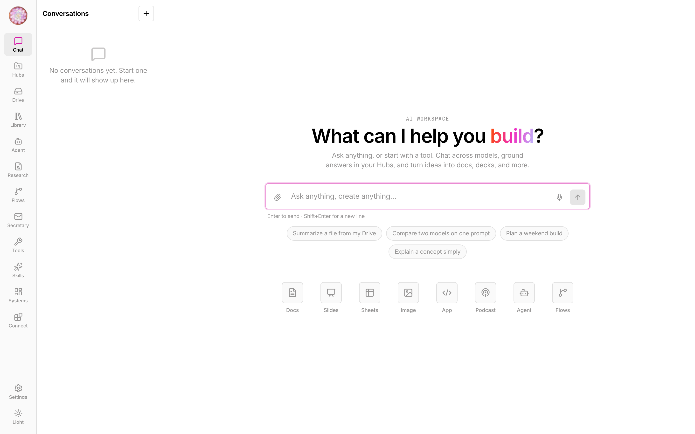
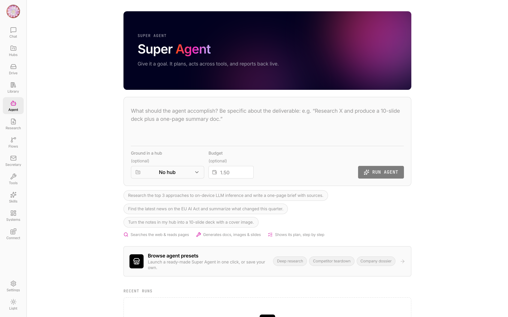
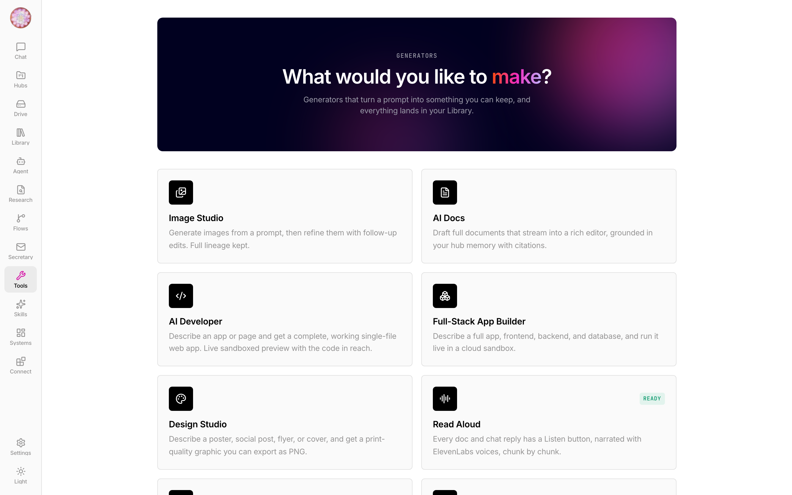
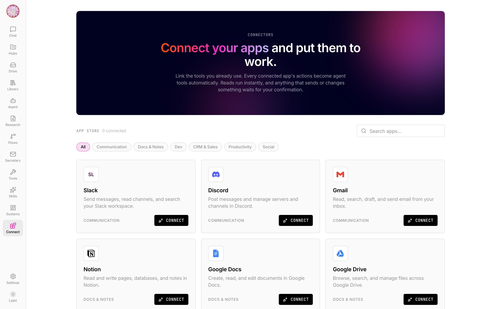

# Omni

**An all-in-one, local-first AI workspace.** Multi-model chat, an autonomous Super Agent
that plans and uses tools, project Hubs with persistent semantic memory, an AI Drive, a
full suite of content generators (docs, slides, sheets, images, audio, web apps, graphic
design), scheduled workflows, and an open connector layer (MCP host + app store) — all
running on your machine against your own keys, with data in a local SQLite database and
the filesystem. No cloud backend, no account, single user.

> Runs entirely on `localhost`: a Fastify API on `:4100` and a Vite/React SPA on `:5175`.
> The only outbound calls are to the LLM/provider APIs you configure.

---

## Screenshots

**Chat** — every model on OpenRouter behind one interface, with your Hubs, Drive and every
generator one keystroke away.



**Super Agent** — give it a goal and a budget; it plans, acts across tools, and reports back
live, staging any write to the outside world for confirmation first.



**Generators** — one service layer behind AI Docs, Slides (real `.pptx`), Sheets (`.xlsx`),
Image Studio, AI Developer, the Full-Stack App Builder, Design Studio and Read Aloud.



**Connectors** — an MCP host plus an app store; every connected app's actions become agent
tools automatically.



---

## Highlights

- **Multi-model chat** — every model on [OpenRouter](https://openrouter.ai) behind one
  interface, streamed over SSE, with prompt caching and per-message cost tracking.
- **Super Agent** — a plan → act → observe → backtrack loop over a tool registry, with a
  live plan checklist, tool-call timeline, budget/cancel/confirm controls, and
  crash-resumable runs. Writes to the outside world stage a confirmation card first.
- **Hubs + memory** — project workspaces with instructions, attached files, and a
  `sqlite-vec` vector index, so chat and generators can ground answers in your material
  with inline citations.
- **AI Drive** — upload files; a background indexer extracts text (LlamaParse → pdf-parse
  / mammoth fallback), chunks, embeds, and makes them searchable per-hub.
- **Generators** — one unified service layer powers **AI Docs**, **AI Slides** (exports
  real `.pptx`), **AI Sheets** (`.xlsx`), **Image Studio** (generate + edit with lineage),
  **Read Aloud / Podcast** (TTS), **AI Developer** (prompt → working single-file web app in
  a sandboxed preview), **Design Studio** (print-quality graphics), **Meeting Notes**, and
  **Deep Research** (multi-search → cited report). Everything lands in your Library and is
  editable with a natural-language "revise" pass.
- **Workflows** — chain the agent, generators, and search into DAGs; run manually or on a
  cron schedule (persisted, rehydrated on boot).
- **Tools & connectors** — 16 built-in agent tools (web search, code execution in a
  sandboxed Deno subprocess, calculator, HTTP, Wikipedia, weather, …), an **MCP host**
  (drop servers into `mcp.json` and their tools become agent tools), and a **connector
  store** (Composio) for 23+ apps (Slack, Notion, GitHub, Gmail, Drive, Linear, …).
- **Systems (AgentBase)** — describe a dashboard/CRM and get a working system: typed
  record tables with computed stat/chart tiles, seeded from a prompt, files, or CSV.
- **Skills & Custom Agents** — a marketplace of reusable prompt-tools and one-click
  Super-Agent presets.

---

## Quick start

**Prerequisites:** Node 20+, npm 10+. Optional: [Deno](https://deno.com) 2.x for the
agent's `run_code` tool (it degrades gracefully if absent).

```bash
cp .env.example .env        # add OPENROUTER_API_KEY (the only required key)
npm install
npm run dev                 # API → http://localhost:4100 · web → http://localhost:5175
```

Open **http://localhost:5175**. Data is created on first boot at `~/.omni/`
(`omni.db`, `drive/`, `artifacts/`, `runs/`); override the location with `OMNI_DATA_DIR`.
Database migrations apply automatically at API startup.

### Environment

| Variable | Required | Unlocks |
|---|:---:|---|
| `OPENROUTER_API_KEY` | ✅ | All chat models, embeddings, image generation |
| `EXA_API_KEY` | — | High-quality agent/research web search (falls back to `:online` models) |
| `ELEVENLABS_API_KEY` | — | Dictation, read-aloud, podcast voices |
| `LLAMAPARSE_API_KEY` | — | High-fidelity PDF/office extraction (falls back to `pdf-parse`) |
| `COMPOSIO_API_KEY` | — | The connector store (Slack/Notion/GitHub/…) |

Every optional integration is **fail-soft**: the feature stays visible and lights up the
moment its key is present — nothing crashes when a key is missing.

**Connecting MCP servers** (optional): copy `mcp.example.json` to `mcp.json` and list any
[Model Context Protocol](https://modelcontextprotocol.io) servers (stdio or http). Their
tools are discovered at boot and exposed to the Super Agent, namespaced `server__tool`.

---

## Architecture

A Turborepo monorepo (npm workspaces, ESM/NodeNext, strict TypeScript).

```
apps/
  api/        Fastify API — chat, agent engine, generators, drive, hubs, routes  (@omni/api)
  web/        Vite + React 19 SPA — Tailwind (CSS-var tokens), SWR, react-router (@omni/web)
packages/
  sdk/        Shared LLM / SQLite / embeddings / content layer                   (@omni/sdk)
  env-config/ Zod-validated environment                                          (@omni/env-config)
  tsconfig/   Shared TS base config
migrations/   Raw SQL, applied in order at API boot
tests/
  api/        Playwright HTTP integration suite (request fixture)
  e2e/        Playwright browser (Chromium) suite — real user workflows over the UI
```

**Stack:** Fastify · Zod · pino · better-sqlite3 (WAL) + `sqlite-vec` · OpenRouter (via the
OpenAI SDK) · Deno (sandboxed code execution) · React 19 · Vite 6 · Tailwind · BlockNote
(docs) · `@modelcontextprotocol/sdk` (MCP host) · Composio (connectors).

**Data model:** app-generated UUID ids, ISO-8601 UTC timestamps, `{ success, data }` /
`{ success, error, code }` response envelopes everywhere. Blobs live on the filesystem;
the SQLite row is the source of truth and the vector index is a rebuildable cache. Fully
offline — no external database.

---

## Testing

The dev servers must be running (`npm run dev`) for the Playwright suites.

```bash
npm run test           # unit tests (vitest: sdk + api pure helpers)
npx playwright test                    # API + browser E2E (both projects)
npx playwright test --project=api      # HTTP integration suite  (tests/api)
npx playwright test --project=web      # real Chromium E2E        (tests/e2e)
```

The **web** project drives actual user workflows in a browser: a nav smoke across every
route (with uncaught-exception crash detection), a chat round-trip (compose → stream a
reply), AI Developer app generation, and the connector store.

---

## Design

Omni's UI follows a **Together-AI-inspired** design language: a white canvas that
alternates with near-black hero bands, a single three-stop brand gradient
(orange → magenta → periwinkle) as the only decorative chrome, a two-face type system
(Inter display + JetBrains Mono uppercase eyebrows/labels), crisp ~4px radii, and hairline
borders instead of shadows. Light is the default; a light/dark/system toggle lives in the
sidebar.

---

## Scripts

| Command | Does |
|---|---|
| `npm run dev` | API + web in watch mode (via turbo) |
| `npm run build` | Production build of all packages |
| `npm run lint` / `typecheck` | ESLint / `tsc --noEmit` across the workspace |
| `npm run test` | Vitest unit tests |
| `npm run test:api` | Playwright suites |
| `npm run db:migrate` | Apply SQL migrations without booting the API |

---

## Status & notes

Single-user by design, but every table carries a `user_id`, so multi-user is a migration
rather than a rewrite. This is a personal project; the code is provided as-is.

_Private repository — all rights reserved._
